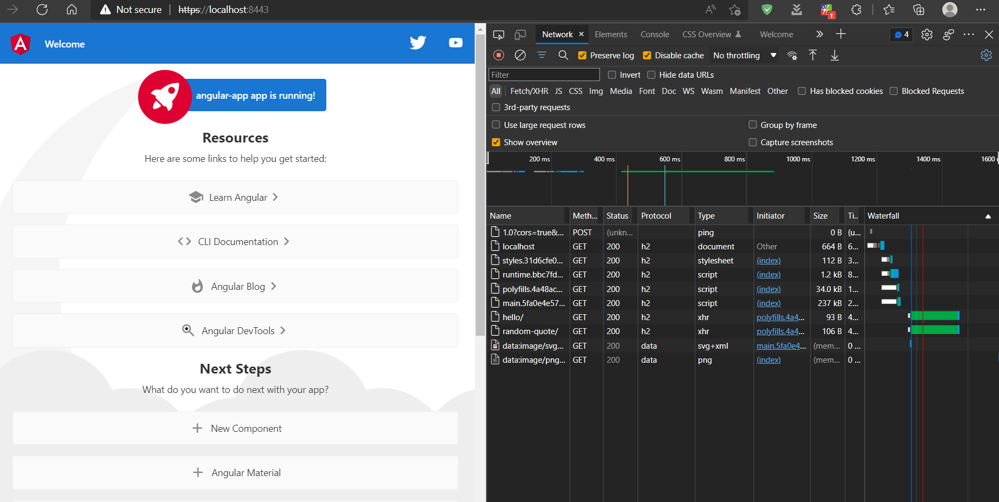
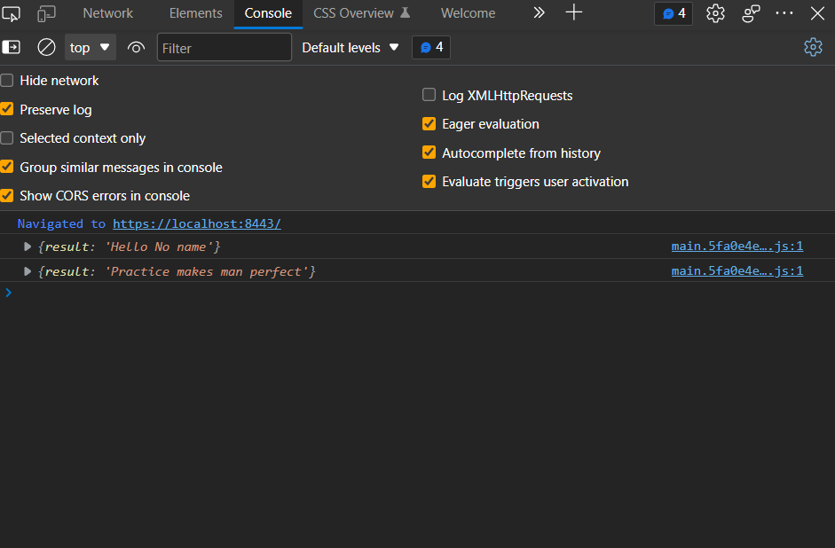

## HTTP2 with Spring, Angular
To enable http2 in Spring, we need to enable https first.
 - Create a self signed certificate, since this is a demo
 - Use following properties in application.properties for ssl: 
   - ``server.ssl.key-store-type=PKCS12``
   - ``server.ssl.key-store=/etc/ssl/certs/https2_test.p12``
   - ``server.ssl.key-store-password=https2_test``
   - ``server.ssl.key-alias=https2_test``
   - ``server.ssl.enabled=true``
 - Enable http2 using the following:
   - ``server.http2.enabled=true``
 - I am using 8443 as embedded tomcat server port.
 - Application code is self explanatory, has two endpoints.

### For UI, Angular is used and code is being deployed into nginx.
- UI code is simple, and has two API calls in ngOnInit.

### Docker compose is used to start up both backend and frontend.
 - Backend dockerfile steps:
   - Dockerfile on the backend side is straightforward:
   - It uses maven java image as builder
   - Copies code into workdir
   - Runs mvn clean install
   - Uses jdk14 image, copies jar, certificates there
   - Importing certificate to cacerts
   - Finally run jar.
 - Frontend dockerfile steps:
   - Uses node lts image as builder
   - Copy all code
   - Run npm install and build
   - Use nginx alpine image to copy build files
   - I created a custom default.conf and copied it to ``/etc/nginx/conf.d/``
     - The custom default.conf has settings related to http2 and ssl certs
   - Add certs into nginx locations:
     - ``/etc/ssl/private/``
     - ``/etc/ssl/certs/``
   - Start nginx with daemon off.

### Changes to default.conf of nginx
 - Add following below default 80 port localhost:
   - ``listen 443 ssl http2 default_server;``
   - ``listen [::]:443 ssl http2 default_server;``
   - ``ssl_certificate /etc/ssl/certs/nginx-selfsigned.crt;``
   - ``ssl_certificate_key /etc/ssl/private/nginx-selfsigned.key;``
   - These steps are saying, here are my certs, use 443 for http2 with ssl.

### Docker compose
 - Compose is pretty simple, it has steps in yml to build backend and frontend:
 - Backend:
   - sbh2 is spring boot http2 service, we just have container name here and build from current path.
 - Frontend:
   - fengh2 is frontend nginx http2 service, it exposes 80 and 443 on 8080 and 8443 respectively, build location and container name.
 - To build and start, we use: ``docker compose up``

### Demonstration
 
 
 We can see in network, protocol for requests is h2.